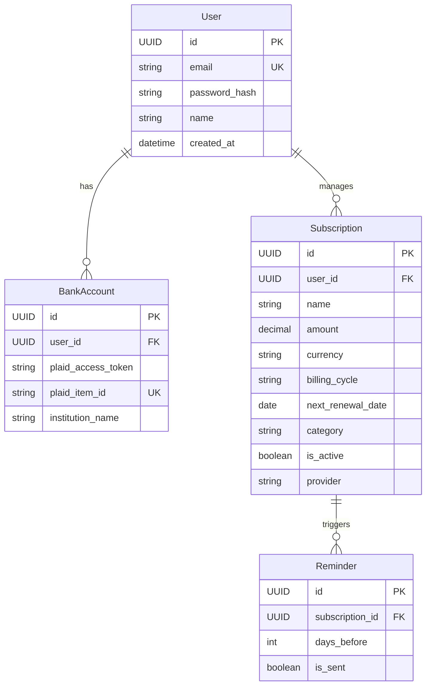

# 💳 Subscription Manager (SubTrack)

A production-grade, full-stack subscription tracking application designed with secure authentication, relational database management, and financial API integration.

---

## 🛠️ Implemented Features & Core Concepts
Here is the core functionality that has been built and implemented in this project so far:
* **Database Management with Prisma ORM**: 
  - Integrated PostgreSQL database connection using **Prisma ORM**.
  - Built relational database schemas (`User` and `Subscription` models) in `prisma/schema.prisma`.
  - Created and ran database schema migrations (`init` and `add_subscriptio`) to synchronize changes.
* **Secure Authentication & Token Flow**:
  - Input validation using **Zod** schema parser.
  - Safe password storage using **Bcrypt** hashing.
  - Session authorization using **JSON Web Tokens (JWT)** delivered via secure, script-inaccessible `HttpOnly` cookies.
  - Route protection through custom middleware (`authMiddleware.js`) decoding cookies to authorize queries.
* **Subscription Management API**:
  - **Create Subscriptions (`POST /api/subscriptions`)**: Accepts validated metadata (platform names, billing cycles, start/renewal dates, payment types) and registers them under the authenticated user.
  - **Retrieve All Subscriptions (`GET /api/subscriptions`)**: Fetches all active subscriptions associated with the logged-in user.
  - **Retrieve Subscription by ID (`GET /api/subscriptions/:id`)**: Correctly matches parameterized IDs to fetch a single subscription record.

---

## 🚀 Key Features
- **Secure Authentication**: Session-based credentials using JWT stored in security-hardened `HttpOnly` cookies.
- **Manual CRUD**: Create, read, update, and delete subscription records manually with transactional schema validation.
- **Plaid Integration**: Connect real bank accounts via the Plaid Link widget to sync transactions and automatically extract recurring subscriptions.
- **Renewal Alerts**: Background scheduler executing notifications (email/alerts) prior to upcoming renewal dates.
- **Dashboard Analytics**: Track total monthly/annual spend, currency conversions, and interactive financial metrics.

---

## 🛠️ Tech Stack

### Frontend (Client-Side)
- **Vite + React (TypeScript)**: Extremely fast development build and type-safe application environment.
- **TanStack Query (React Query)**: Declares server-state management with caching, query invalidation, and optimistic updates.
- **Zustand**: Lightweight client-side global state management for authorization status and user configurations.
- **React Hook Form + Zod**: Schema-based form validation and optimized input rendering.
- **Tailwind CSS**: Contemporary styling framework for clean layouts and responsive user interfaces.
- **Axios**: Promised-based HTTP client using interceptors to handle cookie credentials automatically.

### Backend (Server-Side)
- **Node.js + Express**: Scalable event-driven REST API server.
- **PostgreSQL**: Robust open-source relational database management system.
- **Prisma ORM**: Type-safe query engine and database migrator.
- **Plaid SDK**: Financial services gateway to ingest banking records.
- **Security Libraries**: `bcrypt` (password hashing), `jsonwebtoken` (JWT creation/signing), `cookie-parser` (HttpOnly header processing).
- **Automation**: `node-cron` or queue schedulers to handle automated daily checks.

---

## 🗺️ Project Structure

```text
subscription-manager/
├── client/                 # React Frontend
│   ├── src/
│   │   ├── api/            # API call modules (Axios client config)
│   │   ├── components/     # Reusable UI widgets (Buttons, Modals, Cards)
│   │   ├── features/       # Modules grouped by feature (Auth, Subscriptions)
│   │   ├── hooks/          # Custom hooks (fetching, layout lifecycle)
│   │   ├── store/          # Zustand global states (auth, theme)
│   │   ├── types/          # TypeScript interfaces & types
│   │   └── main.tsx        # Application root mount
│
└── server/                 # Express Backend
    ├── src/
    │   ├── config/         # System variables, DB, and client credentials
    │   ├── controllers/    # Route request/response orchestrators
    │   ├── middleware/     # Auth checks, input validators (Zod)
    │   ├── prisma/         # Database schema.prisma & migrations
    │   ├── routes/         # API path mappings
    │   ├── services/       # Core business logic (DB queries, Plaid sync)
    │   ├── utils/          # Token signers, date helpers
    │   └── server.js       # App entrypoint
```

---

## 📊 Database Schema



---

## 🔌 API Endpoints Reference

### Authentication
* `POST /api/auth/register` - Register a new account
* `POST /api/auth/login` - Verify credentials & issue HttpOnly JWT Cookie
* `POST /api/auth/logout` - Clear the session cookie
* `GET /api/auth/me` - Retrieve current active user profile

### Subscriptions (CRUD)
* `GET /api/subscriptions` - Fetch all subscriptions for the current user
* `POST /api/subscriptions` - Manually record a subscription
* `PUT /api/subscriptions/:id` - Edit a subscription's details
* `DELETE /api/subscriptions/:id` - Delete a subscription

### Plaid Integration
* `POST /api/plaid/create-link-token` - Request Plaid token to launch the Link Widget
* `POST /api/plaid/exchange-token` - Exchange public_token for a secure access_token
* `GET /api/plaid/sync` - Sync banking transactions to update subscriptions

---

## 📈 Learning and Progression Plan
1. **[Completed] Database & ORM Layer**: Set up PostgreSQL connection, schema design, and Prisma configuration.
2. **[Completed] Session Security**: Implement password hashing, JWT operations, and cookie storage. Checked and verified in Postman.
3. **[Completed] Backend REST APIs**: Built core registration, login, and subscription CRUD APIs with Zod schemas and route controllers.
4. **[Next Step] React Client Boilerplate**: Configure Vite, Tailwind, TanStack Query, and Zustand for the user interface.
5. **[Pending] UI Integration**: Build forms (React Hook Form + Zod) and dashboards, connecting them to our backend.
6. **[Pending] External Automations**: Connect Plaid Link, query transactions, and configure background jobs for renewal notices.