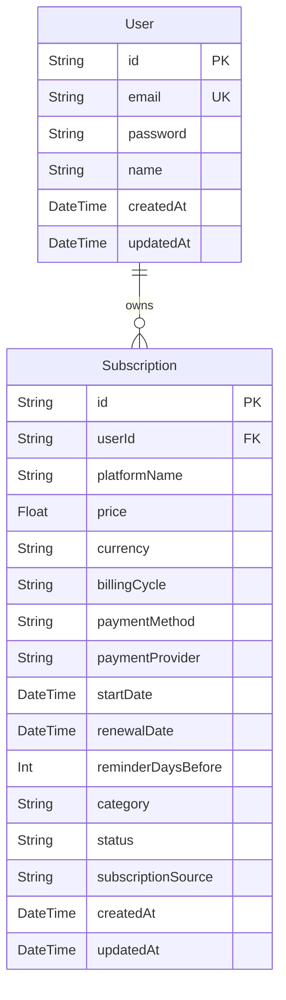

# 💳 Subscription Manager (SubTrack)

A full-stack subscription tracking application built to demonstrate backend architecture, secure authentication, relational database design, and time-based automation logic.

---

## ✅ What's Actually Built (Current State)

### Backend
- **Secure Auth Flow**: Register → Login → JWT in HttpOnly cookies → Protected routes
- **Password security**: bcrypt hashing (10 salt rounds)
- **Input validation**: Zod schemas on all request bodies
- **Subscription CRUD API**: Create, Read (all & by ID), Update, Delete subscriptions — all protected by auth middleware
- **HTTP logging**: morgan request logger
- **CORS + Cookie handling**: cors + cookie-parser configured for cross-origin frontend calls
- **Environment config**: dotenv for secrets management

### Frontend
- **Page routing**: React Router DOM v7 (Landing → Login → Register → Dashboard)
- **Global auth state**: Redux Toolkit + React Redux
- **API communication**: Axios (with credentials)
- **Styling**: Tailwind CSS v4
- **Animations**: Framer Motion
- **Icons**: Lucide React + React Icons
- **Landing page**: Full dark fintech UI — animated hero, feature bento grid, wallet card with 3D tilt, animated stats, CTA, footer

---

## 🚧 What's Planned Next (Priority Order)

### 1. Rate Limiting on Auth Routes *(High Priority)*
- Install `express-rate-limit`
- Apply to `POST /api/auth/login` and `POST /api/auth/register`
- Prevents brute-force attacks — a gap any security-aware interviewer will catch immediately

### 2. Cron Job — Renewal & Expiry Logic *(High Priority)*
- Install `node-cron`
- Daily scheduled job to scan subscriptions where `renewalDate` is within N days
- Transition `status` field from `active → expiring_soon → expired`
- This is what makes it an actual subscription manager, not just CRUD with a subscription-shaped schema

### 3. Test Suite *(Medium Priority)*
- Install `jest` + `supertest`
- Test coverage targets:
  - Auth flow: register, login, logout, /me endpoint
  - Subscription CRUD: all four operations
  - Middleware: reject unauthenticated requests

### 4. Redis Caching *(Future — when learned)*
- Cache subscription-status lookups per user
- Justified use case: cache-aside pattern, distinct from atomic-locking use in auction projects
- Only add when you have Redis running locally and understand invalidation

---

## 🛠️ Tech Stack

### Frontend
| Package | Purpose |
|---|---|
| React 19 | Core UI library |
| Vite | Build tool & dev server |
| React Router DOM v7 | Client-side routing |
| Redux Toolkit + React Redux | Global auth state management |
| Axios | HTTP client for API calls |
| Tailwind CSS v4 | Utility-first styling |
| Framer Motion | Animations & transitions |
| Lucide React + React Icons | Icon sets |

### Backend
| Package | Purpose |
|---|---|
| Node.js | JavaScript runtime |
| Express v5 | REST API framework |
| Prisma ORM + `@prisma/client` | Type-safe DB queries & migrations |
| PostgreSQL (via `pg`) | Relational database |
| `jsonwebtoken` | JWT creation & verification |
| `bcrypt` | Password hashing |
| `zod` | Request schema validation |
| `cookie-parser` | Read HttpOnly cookies from requests |
| `cors` | Cross-origin request handling |
| `morgan` | HTTP request logging |
| `dotenv` | Environment variable management |
| `nodemon` | Dev auto-restart |

---

## 🗺️ Project Structure

```text
Subscription Manager/
├── client/                   # React Frontend
│   └── src/
│       ├── api/              # Axios client config
│       ├── components/       # Reusable UI components
│       ├── context/          # React context providers
│       ├── hooks/            # Custom React hooks
│       ├── layouts/          # Page layout shells (DashboardLayout)
│       ├── pages/            # Route-level page components
│       ├── redux/            # Redux store, slices
│       ├── routes/           # Route protection logic
│       ├── services/         # API call functions
│       └── utils/            # Helper utilities
│
└── server/                   # Express Backend
    └── src/
        ├── config/           # Prisma client, env setup
        ├── controllers/      # Route handlers (auth, subscription)
        ├── middleware/        # Auth guard, error handler
        ├── routes/           # API path definitions
        ├── services/         # Business logic layer
        ├── utils/            # Token helpers, date utilities
        └── validations/      # Zod schemas
```

---

## 📊 Database Schema (Actual)



---

## 🔌 API Endpoints

### Authentication
| Method | Route | Description |
|---|---|---|
| `POST` | `/api/auth/register` | Create account, hash password, return JWT cookie |
| `POST` | `/api/auth/login` | Verify credentials, issue HttpOnly JWT cookie |
| `POST` | `/api/auth/logout` | Clear session cookie |
| `GET` | `/api/auth/me` | Return current user profile (protected) |

### Subscriptions (all protected by auth middleware)
| Method | Route | Description |
|---|---|---|
| `GET` | `/api/subscriptions` | Fetch all subscriptions for current user |
| `POST` | `/api/subscriptions` | Create a new subscription record |
| `PUT` | `/api/subscriptions/:id` | Update a subscription |
| `DELETE` | `/api/subscriptions/:id` | Delete a subscription |

---

## 📈 Progression Log

| # | Task | Status |
|---|---|---|
| 1 | Project setup, folder structure, Git init | ✅ Done |
| 2 | Express server, health routes, Postman validation | ✅ Done |
| 3 | Prisma + PostgreSQL setup, User schema, migrations | ✅ Done |
| 4 | Zod validation, bcrypt hashing, DB registration | ✅ Done |
| 5 | JWT login, HttpOnly cookies, auth middleware | ✅ Done |
| 6 | Subscription schema design & migration | ✅ Done |
| 7 | Subscription CRUD API (Create, Read, Update, Delete) | ✅ Done |
| 8 | React client boilerplate, Tailwind, routing | ✅ Done |
| 9 | Full landing page UI (animated, dark fintech theme) | ✅ Done |
| 10 | Auth pages (Login/Register) + Redux state | ✅ Done |
| 11 | Dashboard UI + subscription list display | ✅ Done |
| 12 | Delete subscription feature | ✅ Done |
| 13 | Rate limiting on auth routes (`express-rate-limit`) | 🔲 Next |
| 14 | Cron job — renewal/expiry status transitions | 🔲 Planned |
| 15 | Test suite (Jest + Supertest) — auth & CRUD coverage | 🔲 Planned |